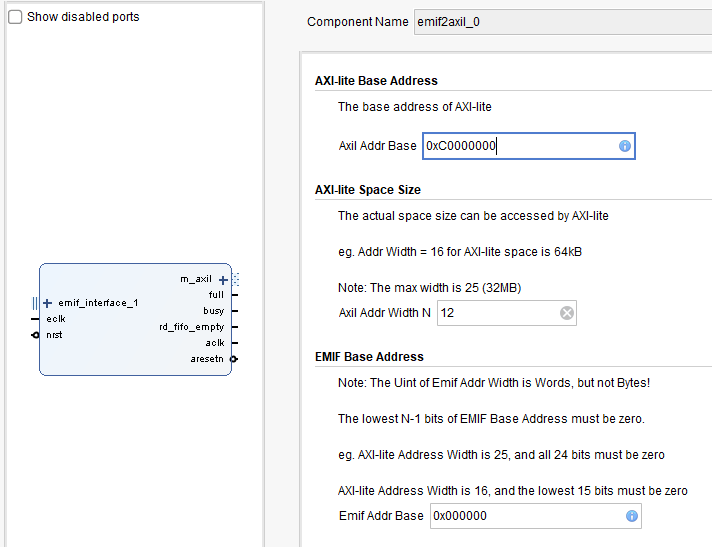
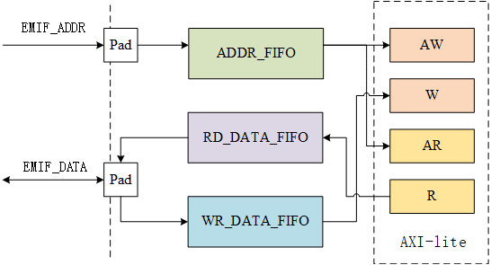

# EMIF to AXI-lite Converter

## 背景

DSP的EMIF与FPGA互连，但随着处理器的更新迭代，EMIF这种并行接口的频率很难再提高，数据传输的速率到达瓶颈，这一接口也慢慢地不怎么被用来传数据了，但是用它传控制命令还是很方便的。FPGA内的IP一般采用AXI-lite作为控制接口，所以就有了这个设计，将EMIF接口转换为AXI-lite master接口，让DSP能够更加方便地控制FPGA里的IP。这个IP适用于FT-M6678 DSP，其它带有EMIF接口的处理器可能需要做部分修改才能使用。

## 文件说明

- emif_interface
  - 这个IP用到的EMIF接口定义。
- emif2axil_1.0
  - IP的源文件
- driver
  - 软件驱动

## IP信号说明

AXI-lite的数据线固定为32bit位宽，EIMF也需要以32bit位宽的同步接口来访问。

|信号|方向|位宽|功能|
|--|--|--|--|
|EMIF接口|/|/|包括读写信号、片选信号、数据和地址信号，可以实现同步/异步存储器访问|
|AXI-lite Master 接口|/ |/|可以接入系统的外设控制总线|
|eclk|输入|[0:0]|EMIF时钟信号|
|nrst|输入|[0:0]|系统复位信号，低电平有效|
|aclk|输出|[0:0]|AXI-lite时钟信号|
|aresetn|输出|[0:0]|AXI-lite复位信号，低电平有效|
|busy|输出|[0:0]|输入地址FIFO非空或者状态机不是IDLE|
|full|输出|[0:0]|输入地址FIFO已满|
|rd_fifo_empty|输出|[0:0]|读数据FIFO空，读请求发出后，数据还未就绪|

## IP的使用方法

- 设置IP的AXI-lite接口访问的空间的首地址
- 设置AXI-lite接口可以访问的空间大小
- 设置EMIF高位地址线的值，防止EMIF在访问其他地址时产生冲突

## 软件使用

- EMIF采用的是同步方式访问。
- 由于AXI-lite存在握手机制，不能简单地作为存储器访问，所以需要FIFO进行缓存。

- 读写地址都会写入ADDR_FIFO，状态机空闲时会根据处理地址FIFO里的读写请求。
- 读和写是依靠地址线的最高位向外扩展一位来判断的，所以虽然DSP的片选空间是64MB，但是最多只有32MB被映射到AXI-lite的地址空间。一半的地址用来读，一半的地址用来写。ADDR_FIFO里存放的相当于是读写请求。
- 每次读写前需要根据full信号判断ADDR_FIFO是否已经满了。
- 写可以正常写。
- 如果要读，就需要先往要读的地址写任意数据（这个数据会被丢弃），然后等待RD_DATA_FIFO非空，即等待数据从AXI-lite的R通道返回。
